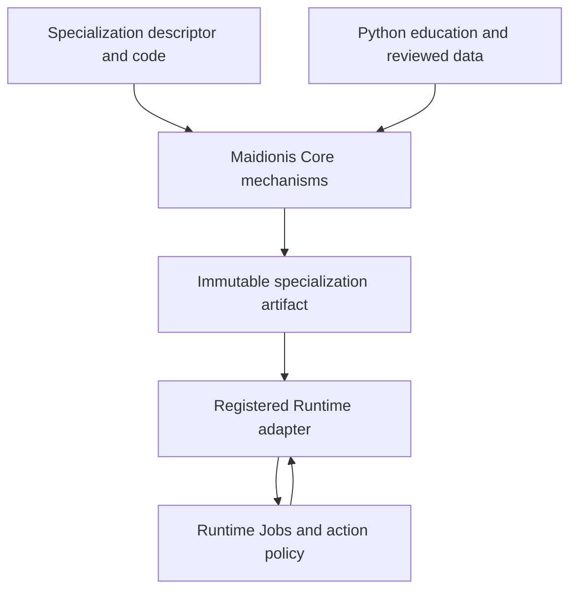

# Architecture and ownership

See [implementation status](implementation-status.md) for the initial implemented CPU profile and deferred qualifications. The reviewed boundary below includes broader profiles.

Status: proposed v1; see the [design index](README.md).

## One authority per responsibility

| Owner | Responsibility | Excluded authority |
|---|---|---|
| Maidionis Core | neutral model components, numerical training/inference routines, bounded contracts, integrity, reproducibility and evaluation mechanisms | task meaning, action policy, global state, Workflow and production scheduling |
| Specialization | semantic descriptor, input assembly, target validation, head/loss composition, output decoding, verifier and evaluation/release policy | changing Core contracts or executing a recommendation |
| Arbitrium | Decision specialization and its research archive | general Core mechanisms and Runtime execution |
| Python education | offline generation/review/audit/freeze and finite experiment coordination | a second neural implementation or production weight updates |
| AI Runtime | live worker/model residency, Jobs, execution leases, Workflow, authorization, deadlines and routing | educational ground truth or task semantics |
| Application/Agent/state owner | product state, durable context, permitted action and freshness policy | treating a model output as permission |

Core owns the implementation of model math; Runtime owns when, where and under
which constraints that implementation runs. Offline training has a training
process and optimizer state, not Runtime Jobs. It cannot activate a service or
allocate production GPU capacity on its own.

## Dependencies and component boundaries

- Specialization code depends on Core contracts; Core never imports Arbitrium.
- Model components consume validated tensors; they do not read JSON, files,
  teacher endpoints or shared state. Assembly belongs to the specialization.
- Core data/checkpoint/artifact I/O sits outside `forward`. A trusted host selects
  roots and digests. Request payloads cannot select files, endpoints or code.
- Core training composes a registered backbone, heads, objective and batch codec.
  No label spelling or recovery policy appears in the neutral training loop.
- Calibration algorithms receive explicit finite data and parameterized policy;
  risk definitions, thresholds and readiness decisions belong to the task.
- Runtime integration code lives in Runtime or an explicitly separate adapter
  target. The Core library has no Runtime/MCP/application dependency.
- Education coordination may invoke verified native tools with argument vectors
  and bounded files/pipes. Python does not run torch or copy model math.

## Composition root

**Arbitrium owns the Decision composition root**, including offline drivers and
the provider bridge. Core exposes registry/component contracts; the compiled
specialization supplies implementations; an explicit application target links
them. Names below are proposed build targets, not existing commands or an ABI.

| Proposed target | Source owner | Dependencies and responsibility |
|---|---|---|
| `maidionis_core` | Maidionis | neutral mechanisms and registry builder; no Arbitrium or Runtime dependency |
| `arbitrium_specialization` | Arbitrium | links Core; Decision codec/validators/heads/objective/decode/verifier/evaluation rules |
| `arbitrium_composition` | Arbitrium | links specialization/Core; installs exact compiled entries and freezes the Decision registry; no Runtime dependency |
| offline train/evaluate/export drivers | Arbitrium | use that composition and Core engines with bounded offline data/resource configuration |
| `arbitrium_provider` | Arbitrium adapter target | links composition and public Runtime adapter contracts; task validation/encoding stays here, transport/accounting stays with Runtime |
| Runtime host composition | Arbitrium or a separate deployment application | explicitly links provider and Runtime library; registers the provider with Runtime under trusted host configuration |

Core never discovers/imports Arbitrium; Runtime's base library/build never imports
it either. Depending on Runtime's public port headers in the separate bridge is
an outward integration dependency, not permission to move Decision code into
Runtime. There is no dynamic library/path/import/plugin discovery in v1.

Startup is: create a Core registry builder → install selected Core numerical
primitives → call Arbitrium's compiled registration function → verify unique
ID/version/config/schema bindings and complete operations → freeze immutable
registry → resolve a descriptor. Registration includes codec, target validator,
head/objective factories, decode/verification and evaluation hooks. A missing,
duplicate or mismatched entry fails startup; no inference/training registration
mutation or unknown-ID fallback. Data chooses an allowed registered ID, never
creates a function or installs a plugin. Artifact compatibility records bind
the tested composition build/dependency identities as well as component versions.
Initialization/training/serving processes use the same resolved operation set;
the checkpoint pins it to prevent silently resuming with changed implementations.

Maidionis's own CLIs/tests can use a neutral composition; they must not hardcode
Decision registration. Generic education orchestration invokes the specialization's
compiled driver rather than assuming a Core binary knows every specialization.
The synthetic non-Decision test composition lives only in Maidionis tests and
links Core without Arbitrium/Runtime; see [acceptance](acceptance-and-migration.md).
Each target remains optional to unrelated applications. M1 defines the builder
surface and M2 proves neutral composition; A2 supplies the actual Decision root.

Python follows the same explicit dependency direction: Arbitrium experiment
driver → `arbitrium_education` → `maidionis_education`. Specialization hooks are
constructed by that driver, not discovered by Core; see
[Python education composition](education.md#python-education-composition).

## Initial numerical profile

Reuse the demonstrated C++20/CMake/LibTorch CPU FP32 path and SentencePiece
tooling before changing frameworks. Keep pooled embeddings and the explicit
encoder as registered **optional components**. They are not mandatory bases for
all future specializations. Head shapes and loss composition are descriptors,
not hardcoded three-label defaults. The source's pooled averaging omits order
and segment membership; do not turn its train-only success into a model-quality
claim. Encoder tensor tests do not establish better language judgment.

Preserve the first extracted numerical profile's actual dimensions and controls:
hidden width 256, encoder 4 layers/4 heads/FFN 1024, maximum sequence length 256,
categorical K in 2..16 and the validated text codec's PAD/control inventory.
These are optional component/profile limits, not universal envelope requirements.
Refactoring head composition or registered shapes gets new component/config
identities and archive compatibility tests; it does not silently redefine a
historical architecture ID while reusing its calibration or weight digest.

The first supported execution profile is serialized, single-worker Linux CPU
FP32 with finite dimensions and allocation limits. LibTorch initialization and
training currently modify process-global RNG/thread/determinism settings.
Until isolation is proven, separate training runs use separate processes and
training never shares a serving process. No cross-toolchain bitwise, Windows,
GPU, OpenCL, arbitrary multimodal or distributed support is claimed.

LibTorch, SentencePiece, nlohmann/json and OpenSSL provide numerical, vocabulary,
format and hashing infrastructure. Inspect existing FLAMORIS contracts before
adding more shared infrastructure. Pin tested distributions/build digests and
licenses in implementation; do not fetch moving branches at configure time.
MCP Core and Logging are not model or training engines and are not mandatory
dependencies. Teachers remain replaceable external education providers.

## Lifecycle

| Object | Owner and transition |
|---|---|
| Dataset | education creates an immutable frozen version after verification |
| Training run | offline controller fixes config/data, constructs seeded model, trains, checkpoints, records termination |
| Candidate bundle | offline export/calibration freezes selected components; `research_candidate` binds registration with evaluation pending and is offline-loadable |
| Completed artifact | evaluation produces immutable evidence; new research-only/release-candidate manifest preserves evaluated components and registration |
| Release registration | human/operator approves an exact digest after required evidence; no automatic promotion |
| Loaded model | Runtime holds validated immutable weights and accounts residency |
| Inference invocation | Runtime owns deadline/concurrency; model consumes one immutable bounded input |
| Retirement | Runtime stops admission, drains workers, verifies release and then retires residency |

Checkpoint resumability is training progress. It is unrelated to Runtime
Continuations or durable production recovery. Serving weights remain immutable.

## Proposed source layout

| Location | Contents after implementation |
|---|---|
| `include/maidionis/` | neutral contracts and native component interfaces |
| `src/contracts/`, `src/data/`, `src/tokenizer/` | validation, manifest I/O and generic codec primitives |
| `src/model/`, `src/training/` | numerical components and training driver |
| `src/calibration/`, `src/evaluation/` | reusable algorithms and measurement primitives |
| `src/artifact/`, `src/inference/` | validated bundle I/O and bounded invocation composition |
| `src/app/` | neutral offline CLI/file boundary; no implicit Decision registration; commands documented only once verified |
| `education/python/src/maidionis_education/` | provider transport, journal, freeze and offline controller |
| `contracts/`, `tests/`, `education/python/tests/` | shared schemas/fixtures and neutral tests |
| `docs/` | reviewed contracts, acceptance and migration evidence |
| Arbitrium repository | `arbitrium` namespace, specialization/composition/drivers/provider bridge, Decision codec/heads/policy, curricula and reports |

Use C++ namespace `maidionis`, Python package `maidionis_education` and format
prefix `maidionis.*`. Naming an architecture/head component does not grant it
task meaning. No stable C++ ABI or installed CLI is promised by this design PR.
